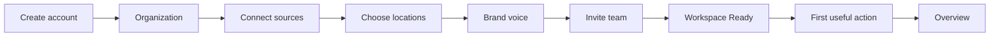

# New-user onboarding

## 1. Purpose

A self-serve owner who has just created an account has an organization with a
name and nothing else: no industry, no timezone, no connected source, no
locations, no voice, and no teammates. Dropping them on `/overview` teaches
them the product is empty rather than that it is unconfigured — every KPI reads
zero, every card renders an empty state, and nothing on the screen says why.

Onboarding is five steps that turn that row into a workspace, followed by a
separate screen that hands over the first thing worth doing.

It is deliberately **not** a settings wizard. Every step already exists as a
real product screen (`/settings`, `/integrations`, `/locations`,
`/brand-voice`), and a completed organization is redirected out of the flow
rather than allowed to run it again.

## 2. Route map



| Route | Step | Purpose |
| --- | --- | --- |
| `/onboarding/organization` | 1 | Enrich the organization created at signup |
| `/onboarding/connect-sources` | 2 | Three sources: connect Google, optionally configure News & Media, see Reddit's real status. Or skip. |
| `/onboarding/locations` | 3 | Map Google listings, or add a location by hand |
| `/onboarding/brand-voice` | 4 | Set the five-axis voice |
| `/onboarding/team` | 5 | Issue invitation links |
| `/onboarding/ready` | — | **Not step 6.** No progress strip, no step badge. |

The group lives at `src/app/onboarding/`, directly under `src/app` rather than
inside `(app)`. That is what keeps the navy sidebar, the organization switcher,
and the badge counts off these screens — all three would be wrong for a
workspace that has not been configured.

## 3. Signup transition

```text
signUpAction
  └─ supabase.auth.signUp()        ← creates auth.users
       └─ trigger on_auth_user_created
            └─ public.users        ← the row every RLS policy resolves through
  └─ organizations.provision()     ← RPC: organization + owner membership
                                     + organization_onboarding, one transaction
  └─ redirect("/onboarding/organization")
```

`provision_organization` was rewritten to insert the onboarding row in the same
function body. A function body is a transaction, which is the only place this
codebase has that guarantee (D17), so an organization can never exist without
somewhere to record its setup progress.

**Email confirmation.** When the Supabase project requires it, `signUp` returns
no session — so there is no `auth.uid()` for provisioning to act as, and the
organization cannot be created yet. The name is carried in signup metadata under
`lia_pending_organization`, and `provisionPendingOrganization()` reads it back
on the first authenticated request (from `/auth/callback` and from
`signInAction`, so either route repairs it).

That key is a **hint, never an authorization**. Supabase user metadata is
writable by the account it belongs to, so anybody could set it on themselves.
It buys nothing: provisioning runs only when the account belongs to *no*
organization at all, so the worst outcome is the empty workspace they could
already have created through the sign-up form.

**Invitation signup is untouched.** `acceptInvitationWithSignUpAction` calls
`invitations.accept` and never `organizations.provision`, and the pending-name
path is gated on a membership check rather than on which form was submitted —
so an invitee is excluded by the fact that they already belong somewhere,
whichever route they arrive through.

## 4. Progress model

One row per organization in `organization_onboarding`, primary-keyed on
`organization_id`. Progress is stored server-side rather than in wizard state
because setup is not a single sitting: it involves an OAuth round trip through
Google, and people routinely start on a laptop and finish on a phone.

| Column | Meaning |
| --- | --- |
| `status` | `in_progress` or `completed` |
| `current_step` | Where to resume. **Advisory** — see below. |
| `*_completed_at` | When a step was finished |
| `*_skipped_at` | When a step was deliberately waived |
| `completed_at` | When the wizard finished |
| `ready_viewed_at` | When the result screen was first opened |
| `organization_size` | Setup metadata, deliberately not on `organizations` |

`current_step` is never trusted. The route guard recomputes the resume point
from the timestamps via `firstIncompleteStep()`, so a stale or tampered value
cannot unlock a step whose prerequisites were never met.

There is one timestamp **per outcome** rather than a single high-water mark,
because a step can be skipped rather than completed and those are different
facts with different consequences — skipping the source step is why location
discovery is unavailable two screens later.

Three check constraints hold the shape: a `completed` row must carry
`completed_at`, and no step may be both completed and skipped.

**Absence means completed.** `get()` returns null for an organization with no
row, and every caller treats that as finished rather than as "start the
wizard". Every pre-existing organization was backfilled, so a missing row is an
anomaly — and the safe direction for an anomaly is into the product, not into a
setup wizard for a workspace somebody has used for months.

## 5. Step prerequisites

A step is reachable when **every step before it is settled** — completed or
skipped. Backward navigation falls out for free (a completed step's
predecessors are settled by definition) and typing the URL of a step three
ahead does not.

| Step | Reachable when |
| --- | --- |
| 1 Organization | always |
| 2 Connect sources | step 1 completed |
| 3 Choose locations | steps 1–2 settled |
| 4 Brand voice | steps 1–3 settled |
| 5 Invite team | steps 1–4 settled |
| Ready | `status = completed` |

At least one of three things must happen before step 3 advances: a Google
profile is mapped, a location is created by hand, or the step is explicitly
skipped. A submission where every mapping row failed does **not** advance — it
returns the per-row reasons and stays put.

## 6. Skip behavior

Three steps offer a skip. Two do not: the organization details and the brand
voice are always answered, which is why neither has a `_skipped_at` column.

| Step | Skip wording | Consequence |
| --- | --- | --- |
| 2 | Continue without connecting | No review import, no Google location discovery, step 3 falls back to manual entry |
| 3 | Skip for now | No locations to route feedback to |
| 5 | Skip for now | No invitations issued; setup still completes |

Step 2's skip requires a deliberate confirmation that states the three
consequences by name. It is a text button, not an outlined one — skipping stays
reachable but must not read as the primary path.

## 7. Step 2 — three sources

Step 2 presents Google Business Profile, News & Media, and Reddit as three
source cards inside one working card, with the same aside-and-card layout as
every other step. The three are not equals and the screen does not pretend
they are:

- **Google** is the prerequisite. The step completes when it is connected, or
  when the person confirms — deliberately — that they are continuing without
  it. Nothing else can satisfy that prerequisite.
- **News & Media** is optional persisted configuration against the real
  monitoring-query system (section 7.2). It never blocks progress.
- **Reddit** is presented exactly as capable as the repository is, which
  today is not at all (section 7.3).

Every status word and count on the screen derives from persisted rows. A card
may say *Recommended*, *Optional*, *Connected*, *Configured*, or *Available
after setup* (`source-status-badge.tsx` is the closed vocabulary); nothing is
ever labelled *Active*, because a saved row proves configuration, not
activity.

### 7.1 Google OAuth return path

The CTA is a real `<form method="post">` to the existing
`/api/integrations/google-business-profile/connect` route. A GET that mints
OAuth state and redirects to a consent screen can be fired by an `` tag on
any page on the internet; POST means the request came from a form on Lia.

`ALLOWED_REDIRECT_PATHS` contains `/onboarding/connect-sources` and
`/onboarding/locations`. Step 2 asks for **`/onboarding/connect-sources`** —
the grant returns to the three-source screen, so the person can configure the
optional monitoring beside the connection they just made before moving on. The
value is validated against the closed list twice — when the state is issued,
and again when it is consumed — so the hidden field is a preference, not an
instruction. An unlisted path is silently ignored rather than rejected, which
is the safest handling for the parameter an open-redirect attack wants.

Nothing about the grant reaches the URL: the callback appends `connected=1` and
the account name, never a code, a token, or the state value.

**The callback settles the source step itself** when the grant's return path
is an onboarding path: it re-reads the onboarding row, and unless the
organization has already finished setup it calls `completeSourceStep` —
best-effort, with failure swallowed, because losing the redirect over a
progress write would strand somebody who just granted access. This is what
makes the return loop-free: step 2 renders as a settled, revisitable step, and
**Save and continue** merely records the (idempotent) completion again on the
way to step 3. Both repository adapters clear `source_skipped_at` when they
set `source_completed_at`, so someone who skipped, came back, and connected
does not trip the both-timestamps check constraint. A grant that started from
`/integrations` never touches onboarding — the gate is the stored return
path, and a completed organization is refused belt-and-braces on its own
status.

If Google was connected on a previous visit, step 2 shows the connection with
the safe account name and a quiet **Manage connection** reauthorization form;
the primary action stays **Save and continue**, and nobody is pushed through
OAuth again for revisiting the step. `completeOnboardingSourceAction` still
re-reads the connection server-side — a client that could mark the step
complete without one would let anybody past the only step with a real
external prerequisite. No duplicate connection is created:
`platform_connections` is upserted on `(organization, platform)`.

### 7.2 News & Media configuration

The card is backed entirely by the existing monitoring-query architecture —
there is no onboarding-only news table, no second validation schema, and no
parallel write path.

- **Input** is `onboardingNewsMonitoringInputSchema`, a `pick` of the real
  create schema: name, keywords, exclusions, country, postal code, city,
  region, language, enabled. The
  advanced fields the wizard never shows get the documented defaults on
  create — `queryType: "brand"`, `locationId: null`, empty publisher lists,
  `DEFAULT_RELEVANCE_THRESHOLD` (0.35), `DEFAULT_POLL_INTERVAL_MINUTES` (240)
  — and are **left untouched on update**, so tuning done on the News & Media
  screen survives a revisit to step 2.
- **The save path** is `saveOnboardingNewsMonitoringAction` →
  `saveOnboardingNewsQuery` → the existing `createMonitoringQuery` service,
  which provisions the implicit `news_media` connection (D80) and records the
  same audit events a save from the News & Media screen records. The action
  requires `monitoring.manage_queries`, the same permission that screen
  requires.
- **Which query onboarding manages** is decided by `findOnboardingNewsQuery`
  over the persisted `origin` column (`20260808000600_monitoring_query_origin`):
  among organization-wide brand queries, the wizard's own
  (`origin = 'onboarding'`) wins outright, then the oldest by `createdAt`
  (id as tiebreak) as the fallback for rows that predate the column — never
  the display name, which anybody can edit. Repeated saves therefore edit
  one row rather than accreting "Brand watch" copies, and a hand-created
  brand query is adopted rather than shadowed. A wizard query the user has
  since rebound to a location or retyped stops being a candidate: that was a
  person's decision and step 2 does not undo it. `origin` is provenance, not
  behaviour — polling never reads it, it is absent from the public update
  input, and the public create action forces `user` regardless of what the
  browser sent.
- **Prefill** comes from real organization data only: the organization's name
  as the monitoring's name (`watchQueryName` — "Ember & Oak watch", the same
  rule step 3 names its location queries by, shortened on the subject rather
  than the suffix when the organization name exceeds
  `MAX_MONITORING_QUERY_NAME_LENGTH`) and as the first keyword, with its
  website host as a one-press suggestion. No fabricated aliases, people, or
  location names — step 3 has not chosen locations yet, and the wizard does
  not pretend otherwise. The country prefills from the organization's own
  configured language tag ("en-GB" → United Kingdom) when that resolves to a
  country the picker offers; the locality prefills as empty, for the same
  reason — there is no address on file yet, and a guess here would become a
  stated fact about where somebody operates.
- **Market and local anchor.** The country picker is
  `MONITORING_COUNTRIES` (`src/lib/geo/countries.ts`) — the 30 codes GNews
  actually filters on, not a curated subset, because a country in the list
  that the provider ignores is a promise the product cannot keep. Beneath it,
  an optional postal code auto-fills a city and region through
  `lookupPostalCodeAction`. Three rules make this safe to lean on:
  - The postal field is **disabled until a country is chosen**, and changing
    the country clears the code and the locality with it. This is where the
    "a postal code needs a country" invariant lives —
    `monitoringQuerySchema` deliberately does not enforce it, because a
    partial update carries no country to check against.
  - **City and region are always editable**, in every country. The lookup
    resolves an area rather than a precise town in several markets (a UK
    outward code, a Canadian forward sortation area), and a country with no
    lookup coverage at all is still offered — the fields are simply typed in.
  - **A failed lookup fills nothing.** It says what went wrong in Lia's own
    words and leaves the fields alone. The provider (Zippopotam) is free and
    unauthenticated, so it has no SLA and nothing is allowed to depend on it.
  What is saved changes no behaviour today: only the country reaches a poll.
  The postal code and locality are stored for the provider upgrade that can
  search regionally (D71), and the card's own copy says so rather than
  implying local coverage already works.
- **There is no Save button.** The panel autosaves through the shared
  `useAutosave` hook (`src/components/autosave/`, promoted out of brand voice
  so both surfaces share one implementation): an 800 ms settling window, one
  request in flight at a time, and the shared `SaveStatus` line saying
  whether what is on screen is on the server. Fields are never disabled while
  a save runs, and a failure keeps the edits on screen with a retry.
  - Client-side validation (a name, at least one keyword) short-circuits
    before the request, so autosave spends nothing discovering what the
    server would reject anyway.
  - Both ways out of the panel — **Done** / the close control, and the step's
    own **Save and continue** — `flush()` first, so the settling window can
    never swallow the last edit. A flush that fails keeps the panel open;
    navigating would discard the input over it.
  - "Save and continue" with the panel open on **untouched defaults** and
    nothing yet persisted writes those defaults: with the Save button gone
    that press is the confirmation of them. Closing the panel untouched is
    not, and writes nothing.
  - **Audit volume is managed at the two places it can be.** One
    configuration session used to be one `monitoring_query.updated` event;
    under autosave it is one per settled edit, and `audit_events` is
    append-only by construction, so nothing can be merged after the fact.
    Two levers, both taken:
    - **A 2 s settling window** (`SETTLING_MS`) rather than the hook's 800 ms
      default, which folds the way people actually fill this in — one
      keyword, then the next — into a single write. The panel can afford the
      longer wait precisely because every exit flushes: unlike the brand
      voice screen, the timer is not the only thing standing between an edit
      and the database, so it is tuned for coalescing rather than for safety.
    - **No event when no field moved.** `saveOnboardingNewsQuery` records
      only when the diff is non-empty. Under a Save button a no-op press was
      at least a decision somebody made; under autosave it is a timer firing,
      and an entry saying nothing could never be cleaned up. Every event that
      does survive still carries its real before-and-after, so the chain
      stays continuous.

    What remains — one event per genuinely distinct edit — is the honest
    record of what happened, and is the trade already accepted for brand
    voice autosave.
- **The summary** on the card (`summarizeNewsMonitoring`,
  `lastSuccessfulNewsPollAt`) is derived from persisted queries and
  `news_poll_runs`: enabled-query count, unique keyword count, language and
  country only when every enabled query agrees, and the last **completed**
  poll's time — otherwise "Not checked yet". The badge says *Configured*, not
  *Active*.
- **Step 3 creates one location query per newly configured location** —
  `ensureOnboardingLocationQueries`, called best-effort from both step-3
  actions after the step has completed, so no monitoring outcome can fail
  the step. The rules, in order:
  - **Opt-in**: it runs only when an *enabled* onboarding-managed brand
    query exists. Somebody who skipped the News card must not find queries
    (and an implicit `news_media` connection) they never asked for.
  - **Never writes an existing row**: a location that already has any
    location-bound query is skipped — which is what makes a retried
    submission idempotent and guarantees a user-edited or user-paused query
    is never overwritten, re-enabled, or duplicated.
  - Keywords are the location's persisted name plus its persisted city when
    distinct; language and country are inherited from the brand query; all
    other fields take the documented defaults, `origin: 'onboarding'`.
  - Each creation goes through `createMonitoringQuery`, so the normal
    `monitoring_query.created` audit event is recorded.
  - Location ids resolve through the caller's scope before use, and the
    pass runs only for roles holding `monitoring.manage_queries`.

### 7.3 Reddit

There is no Reddit connector, monitor, persistence, or polling service in
this repository — `getConnector("reddit")` throws, and
`tests/onboarding-sources.test.ts` pins that fact to the card. The card
renders the *Available after setup* badge, honest copy, and a genuinely
disabled **Configure after setup** button whose reason travels with it via
`aria-describedby`. No configuration form, no counts, no last-checked time,
and no write path of any kind. `docs/architecture/current-state.md` records
the capability gap.

## 8. Location mapping

Step 3 reuses `listGoogleBusinessAccounts`, `listGoogleBusinessLocations`,
`buildCandidates`, and `saveGoogleLocationMappings` — the same services the
integrations setup screen uses, including their server-side re-fetch of every
selected listing. A form field naming a Google location id is a claim, not
evidence.

**A suggestion is never applied.** `buildCandidates` computes a fuzzy match, and
the wizard renders it as an option labelled *(suggested match)* — never as the
selected value. The default for an unmapped row is "Create in Lia", which is
always safe. A wrong mapping sends one restaurant's complaints to another's
queue, where somebody answers them in good faith about a meal that was never
served there, and the damage is invisible until it is public.

Row states: **Matched** (existing in Lia), **Create in Lia** (new location),
**Not selected**, **Already connected** (locked, no control), **Unavailable**
(a previously disconnected listing).

Failures are per row. Nine locations that mapped correctly are kept when the
tenth collides, and each failure is shown against its own row.

When no usable connection exists, the route renders a genuinely different
screen: a manual location form. There is no empty Google table and no refresh
button that could never return anything — that would tell somebody their Google
account has no locations when the truth is that no account is connected.

## 9. Brand-voice persistence

Step 4 reads and writes the **existing** profile through `saveBrandVoice`, the
same service `/brand-voice` uses. There is no second brand-voice schema and no
onboarding-only storage, so a voice set here is the voice the product uses.

Edits on step 4 **save themselves**, through the same shared `useAutosave` hook
and the same `updateBrandVoiceAction` as `/brand-voice`: a slider on release, a
phrase immediately, then the 800 ms settling window so a burst of edits becomes
one request, with the shared `SaveStatus` line saying whether what is on screen
is on the server. Autosave writes the **voice only** — it never advances the
wizard, because settling step 4 is the person pressing the button, not them
touching a slider. **Save and continue** flushes anything outstanding first, so
two writes to the same profile cannot interleave, then completes the step
exactly as before; a step reached without any autosave landing behaves as it
always did. A failure keeps the edits on screen.

The two writes — the profile, then the step — are not one transaction (the
repository interface has none to open). The order is what makes that safe: the
voice is saved first, so a crash between them leaves the settings persisted and
the step unmarked. The form is seeded from the stored profile, so the person
returns to their own answers and presses the button again. **Nobody is ever
asked to re-enter a voice they already saved.**

The preview is deterministic and calls no model. Three reasons, in order:
dragging five sliders would fire a request per frame; `LIA_AI_MODE` is
frequently unconfigured during onboarding, which is the one moment a new
customer must not meet a configuration error; and a model's answer would be one
sample from a distribution shown beside a claim that this is how Lia replies.
The screen labels it *"Preview — an illustration, not a published reply"* and
states that the example review is made up.

**The same preview now renders on `/brand-voice`.** It lives in
`src/lib/brand-voice/preview.ts` — it moved out of `src/lib/onboarding/`, where
being filed under the wizard was what let the two screens diverge. The settings
page had shown a placeholder reading *"Available once response drafting
arrives"*; drafting shipped, which made the sentence false, and the deeper
problem was that the screen somebody returns to was less capable than the one
they saw once. Response drafting having arrived does **not** make this module
redundant: a real draft is a better sample and a worse control, because it
cannot follow a slider and it fails when no provider is configured.

Three things are shared rather than restated, and each was a way the two could
drift: the reply text (`buildVoicePreview`), which phrases are flagged
(`prohibitedPhraseMatchesInPreview`), and the sentence used to flag them
(`describePreviewConflicts`). The phrase-field hint is shared the same way, as
`PHRASE_LIMIT_HINT` beside the two limits it quotes — `/brand-voice` used to
state neither the matching rule nor the caps, revealing the 20-phrase limit only
by refusing a 21st chip. What is deliberately *not* shared is the chrome:
onboarding sits outside the app shell on the public-site brand, so each surface
renders its own markup. `tests/brand-voice-onboarding-alignment.test.ts` pins
the parity by reading both component sources, because what regressed here was
never a return value — it was one screen importing something the other did not.

## 10. Invitation-link behavior

Lia does **not** email invitations (D55: Supabase's built-in SMTP on a new
project is rate-limited and may deliver only to project members, so an
email-only invitation would fail silently and look like a bug in Lia). Step 5
issues copyable links, and the screen says so in as many words — the button
reads "Finish setup", the results panel reads "Copy these invitation links now",
and the *what happens next* list says links can be copied and shared. Nothing on
the screen contains the word "sent".

Each link is shown **exactly once**. Only the SHA-256 hash reaches the database;
the raw token is never persisted, never logged, and never written to an audit
event. A link that is not copied cannot be recovered — it can only be revoked
and reissued from `/settings`, which the panel says.

Rows fail independently. One invalid address must not discard the links already
generated beside it, because those links cannot be regenerated. Setup completes
regardless: somebody whose three addresses were all typos has still finished
setting up their workspace.

The owner row is locked with no remove control. A constraint trigger refuses to
leave an organization with no active owner, so an editable row would offer
something the database refuses. Owner is absent from `INVITABLE_ROLES` and
therefore from the role select.

## 11. Workspace Ready quick-win hierarchy

`resolveQuickWin()` reads real repository data and returns the first rung that
applies:

1. **A response draft awaiting a decision** → *Review first suggestion*, routed
   to the workspace for the mention it answers
2. **An analysed mention** → *Review first analysed mention*
3. **An imported mention** → *Review imported feedback*
4. **Connected profiles, no sync yet** → *Start importing reviews* (an action,
   not a navigation)
5. **Nothing connected** → *Connect Google Business Profile*

Each rung is strictly weaker than the one above. Reaching rung 5 means step 2
was skipped, which is the only honest thing left to say.

"Go to Overview" is a quiet secondary link and never displaces the quick win.
The setup summary is a compact two-column strip beneath it, not five large
numbered rows: it is a receipt, and the point of the screen is the first thing
worth doing next.

### Import progress

**There is no scheduled review sync.** `vercel.ts` schedules the news poll and
the analysis sweep; neither touches reviews. So the flow does not enqueue an
import at step 3 — inventing a background job to enqueue against would mean the
ready screen claimed an import that nothing would ever run.

Instead the screen offers a real, user-triggered **Start importing reviews**
action that calls `syncGoogleReviews`, the same service the integrations screen
uses, once per connected profile, sequentially (parallel syncs against one
shared Google credential is how a first-day customer meets a quota error).

The import panel renders only from `platform_sync_runs` rows, and
`ImportStatus` has **no field that could hold a percentage**. Google does not
report how many reviews a location has until a page has been fetched, and even
then `totalReviewCount` is optional — a bar at "68%" with nothing behind the 68
would be the most misleading thing this page could show. A provider total, when
one exists, is rendered as "of N" and never divided. Counts come from finished
runs only; a run still in flight has tallies that would tick backwards.

`hasStarted: false` is a real answer, not an empty state, and the panel says so.

## 12. Route guards

Two guards, pointing in opposite directions, which is what keeps them from
looping.

| Guard | Where | Diverts |
| --- | --- | --- |
| `requireOnboardingStep(step)` | each step page | **completed** organizations out to `/overview` |
| `redirectIfOnboarding()` | `(app)/layout.tsx` | **incomplete** organizations in to the resume step |

A finished organization satisfies the first and is untouched by the second; an
unfinished one is the reverse. Neither can hand back to the other.

`redirectIfOnboarding()` runs **before** the sidebar queries and before anything
renders, so a half-configured workspace never shows a dashboard implying setup
is done.

Only owners and admins are diverted. Every step is an owner-or-admin decision,
so sending an analyst to a wizard they cannot operate would strand them at a
form with every control refused. Everybody else sees the product, partially
configured — which is honest, because those screens render real data and real
empty states.

`/onboarding/ready` uses `requireOnboardingReady()` instead: the mirror image,
sending an organization that has not finished back to finish it, and letting a
finished one through as many times as it likes.

`middleware.ts` lists `/onboarding` in `PRODUCT_PATHS`, so an anonymous request
gets the sign-in page rather than a redirect from the layout.

## 13. RLS and authorization

`onboarding.manage` is held by **owner and admin only** — narrower than
`can_write_in_organization`, because finishing setup decides what everybody in
the organization sees on sign-in, and because its five steps are each already an
owner-or-admin decision on their own.

`organization_onboarding` has RLS enabled with:

- **select** — any active member (`is_organization_member`). The guard runs for
  every role, so every role needs the read. Nothing sensitive is in the row.
- **insert / update** — `has_organization_role(..., ['owner','admin'])`,
  mirroring the permission. Restated in SQL rather than trusted to the
  application: a check in application code protects only the path that runs it.
- **no delete**, and the grant is revoked so the absence is deliberate. Deleting
  the row would read as "never onboarded", which the application treats as
  complete — a delete would look like a setup that never happened.

Other controls:

- OAuth state stays single-use, expiring, user-bound, and organization-bound.
- Invitation tokens stay hashed at rest; raw links are shown once.
- No credential enters client props. Step 2 receives the Google account **name**
  and nothing else — no account id, no scopes, no tokens.
- No client component imports a service-role client or a `server-only` module.
- Every redirect path is internal and allowlisted.
- Every write is validated with Zod before anything else happens.

## 14. Testing

Eight suites, all against the demo adapter and the real source:

| Suite | Covers |
| --- | --- |
| `onboarding-progress.test.ts` | settlement, reachability, resume, step table, step-1 input schema, offered options |
| `onboarding-repository.test.ts` | provisioning, transitions, idempotence, completion refusal, cross-organization isolation |
| `onboarding-routing.test.ts` | signup, invited signup, completed bypass, resume, role-gated diversion, guard shape, ready framing |
| `brand-voice-preview.test.ts` | determinism, no provider, every axis has an effect, phrase handling (was `onboarding-preview.test.ts`; renamed with the module, which both screens now share) |
| `onboarding-ready.test.ts` | quick-win hierarchy end to end, import status from real runs, no percentage field |
| `onboarding-permissions.test.ts` | permission matrix, RLS policy text, OAuth allowlist, audit vocabulary, no credentials in client code, mock mode |
| `onboarding-accessibility.test.ts` | `aria-current`, labels, sliders, hidden decoration, the disabled Reddit control's explanation, the configurator's focus and announcement behaviour, heading order, no product palette |
| `onboarding-sources.test.ts` | step 2's three-source model and the origin marker: onboarding-query selection (marker first, structure as fallback), dedupe-safe News saves, schema-compliant defaults, truthful summaries, Reddit's absent capability, Google-only completion, step-3 location queries (opt-in, idempotence, no-overwrite, tenancy), origin immutability |
| `onboarding-activation.test.ts` | the overview banner appears only while its condition holds, and disappears |

`supabase/tests/rls-verification.sql` gained a section 9 covering
`organization_onboarding`: cross-organization reads return nothing,
cross-organization updates match no rows, an analyst can read but cannot mark
setup complete, and nobody can delete a row. **All seven checks pass against a
local Postgres.**

### What has been run against a real database

`supabase init` + `supabase start` + `supabase db reset` on a local stack
(never the linked remote):

- both migrations apply cleanly from an empty database, in order, after the
  other twenty-three;
- the seed loads, and both seeded organizations land as `completed` with
  `completed_at` equal to their own `created_at`;
- every organization has exactly one onboarding row;
- `provision_organization` creates the organization, the owner membership, **and**
  the onboarding row at step 1 in one transaction, with the actor taken from
  `auth.uid()`;
- all five table constraints refuse what they are supposed to: `completed`
  without `completed_at`, a step both completed and skipped, an unknown
  organization size, a second row for one organization, and an orphan row;
- RLS is on, there is no delete policy, and section 9's seven checks pass;
- `supabase/tests/rls-verification.sql` now passes **end to end — all 34
  checks**. It did not before: section 8's analyst-delete assertion expected
  an exception where an RLS `using` clause filters silently, which failed
  against a real database and hid every section after it. Corrected to assert
  `row_count = 0`, matching section 3's cross-tenant UPDATE check;
- 21 assertions against the **Supabase adapter** under a real signed-in user
  session — so every policy applied — covering the `nowIfUnset` sentinel's
  idempotence, the skip/complete transitions, the completion refusal,
  `markReadyViewed`, `organizations.update` (including that the slug does not
  move), and `create()`'s upsert.

`audit-vocabulary-migrations.test.ts` (pre-existing) asserts the migration's
check constraint matches `AUDIT_EVENT_TYPES`, and covers the eleven new events.
`seed-generator-columns.test.ts` (pre-existing) asserts the seed generator's
column list matches the new table's real columns.

## 15. Known limitations

1. **No real browser was driven.** The walkthrough was HTTP-level against a dev
   server in demo + Google mock mode. Rendering, both guards, all five steps,
   both step-3 paths, the ready screen, and a full mock OAuth round trip were
   verified; layout at 375 / 768 / 1024 / 1440 px was **not**.
2. **No real Google OAuth flow has run.** Mock mode exercises state issue,
   callback, code exchange, discovery, and mapping, but no live Google Cloud
   project was involved.
3. **Review import is manual.** There is no scheduled review sync, so a customer
   who closes the ready screen without pressing *Start importing reviews* has an
   empty workspace until they press it on the integrations screen. The
   activation banner on `/overview` is what surfaces that.
4. **Step 1's two writes are not atomic** (organization row, then onboarding
   row). Ordered so a crash leaves the details saved and the step unmarked,
   which is recoverable by pressing the button again.
5. **The activation banner's dismissal is per-session.** Persisting it would
   need a column, and the banner already removes itself when its condition stops
   being true.
6. **An invited admin joining an organization whose owner abandoned setup will
   be diverted into the wizard.** The guard is role-based and state-based rather
   than signup-path-based; that organization genuinely is unconfigured, and the
   admin has the authority to finish it.
7. **A cancelled Google grant loses its message during onboarding.** The
   callback's failure path redirects to `/integrations?error=…`, and the
   product shell's guard immediately diverts an unfinished organization back
   into the wizard — dropping the query string. The person lands on step 2
   with Google accurately shown as disconnected, but without the sentence
   explaining why. Fixing it would mean redirecting failures to a path taken
   from an unconsumed state parameter, which is exactly the parameter the
   open-redirect protections exist to distrust.
8. **Reddit monitoring does not exist.** The step-2 card says so; nothing in
   this repository ingests, persists, or polls Reddit. See
   `docs/architecture/current-state.md`.
9. **A hand-created organization-wide brand query is adopted by step 2.**
   When no `origin = 'onboarding'` query exists, `findOnboardingNewsQuery`
   falls back to the oldest org-wide brand query — so the wizard edits such
   a query rather than creating a duplicate beside it. Intended behaviour,
   but worth knowing.
10. **Location queries are created only during onboarding's step 3.** A
    location added later from `/locations` gets no automatic News query —
    the pass is deliberately scoped to the wizard, and later coverage is a
    decision for the News & Media screen.

## Organizations created from inside the product

Setup is no longer only a sign-up flow. `/organizations/new` lets any
authenticated user create an organization — regardless of their role in any they
already belong to — and it enters this same wizard at step one, because a
brand-new organization is a name and nothing else whether it arrived through
sign-up or through the switcher.

Three things follow, and all three are deliberate:

- **The new organization becomes active immediately.** The creating action
  writes the selection cookie before returning, so the wizard it hands to is the
  new organization's own.
- **Existing organizations are untouched.** Creating one writes nothing to any
  other organization's onboarding row — pinned by a byte-identical snapshot in
  `tests/organization-creation.test.ts`, because "still in progress" is a weaker
  assertion than "unchanged", and advancing `currentStep` would be the same
  defect in a quieter form.
- **A double-click creates one organization, not two.** The form carries a
  request key generated once per mount; a replay returns what the first call
  created and writes nothing — no second membership, no second onboarding row,
  no second audit event.

`provisionPendingOrganization`'s membership guard still prevents an invitee from
picking up a *second, empty* organization during a confirmation flow. That was
never a standing prohibition on invitees owning an organization, and now that
there is a deliberate way to create one, the distinction matters: somebody
invited to their employer's workspace may also run a restaurant of their own.

Adding a location outside the wizard does **not** touch onboarding. That is why
`createLocationAction` exists separately from `createOnboardingLocationAction`,
which also completes step 3 and seeds monitoring queries.
